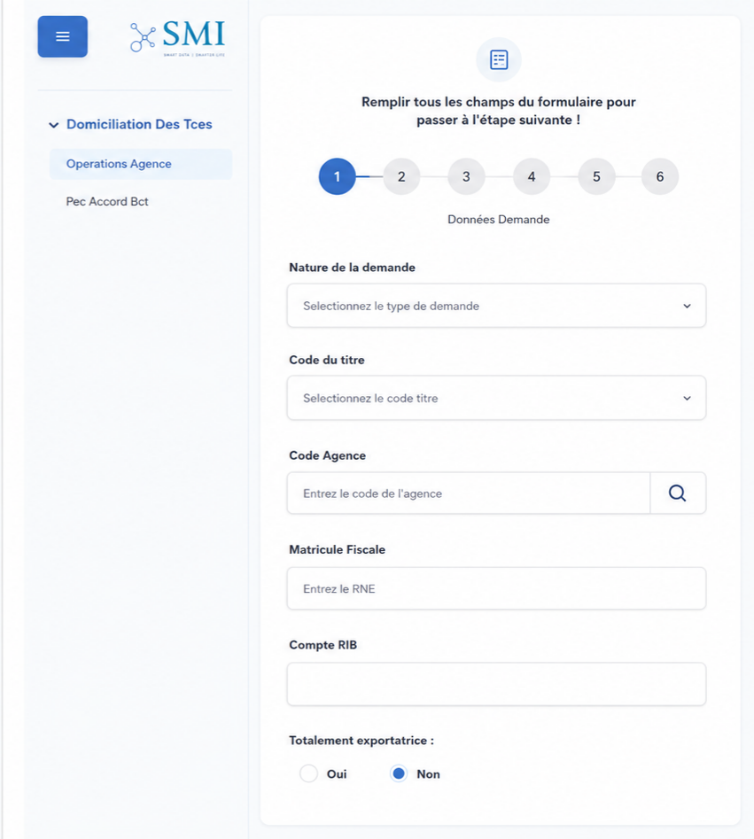
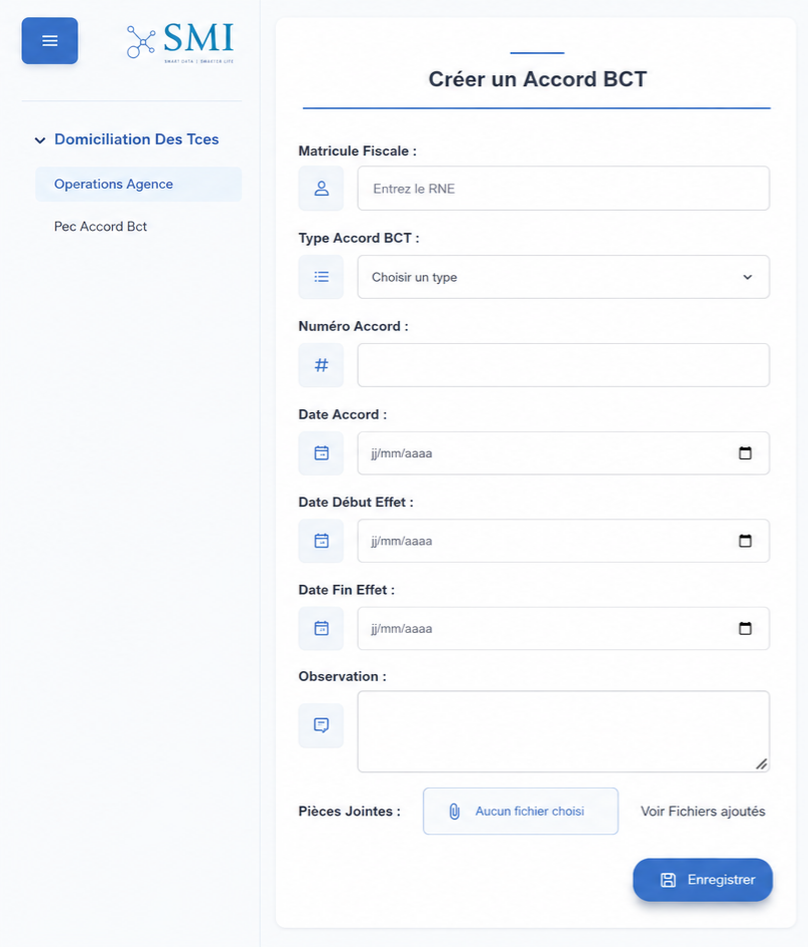
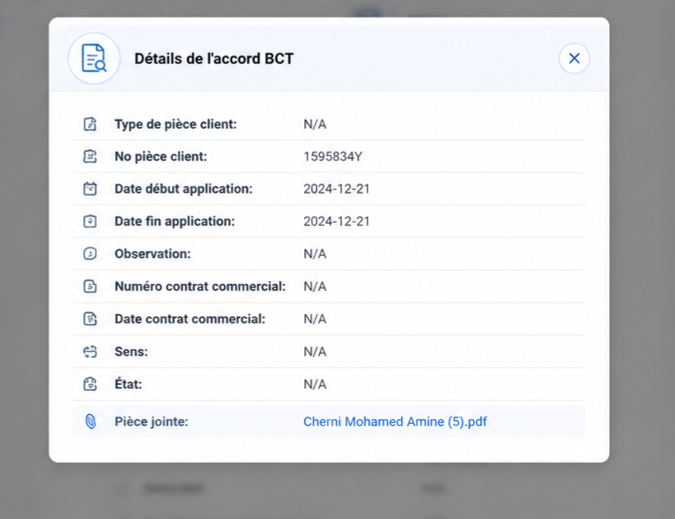
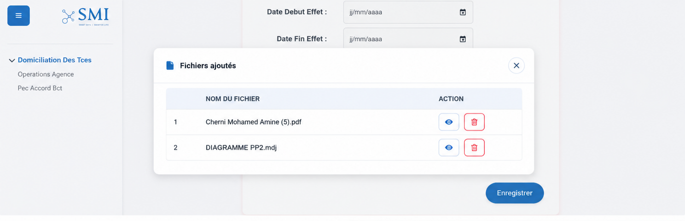
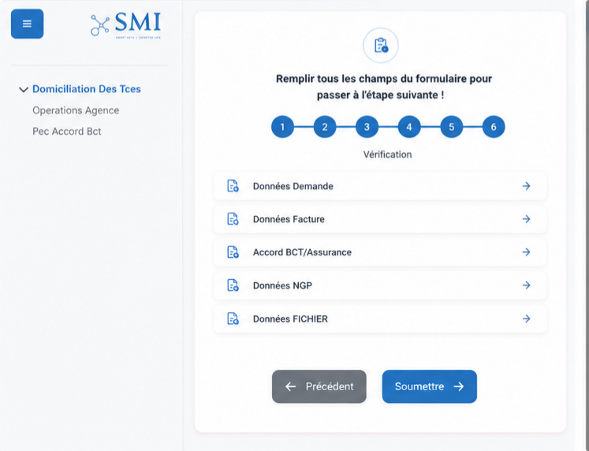

# 🏦 Domiciliation — Modernisation d'un module bancaire de commerce extérieur
 
[](https://www.java.com)
[](https://spring.io/projects/spring-boot)
[](https://angular.io)
[](https://www.keycloak.org)
[](https://www.docker.com)
[](LICENSE)
 
> Refonte d'un système bancaire historique (**Oracle Forms**) en une architecture **microservices moderne** (Java Spring Boot + Angular), appliquée au module de **Domiciliation des Titres de Commerce Extérieur**.
 
Projet réalisé dans le cadre d'un stage effectué chez **Info-Z, en sous-traitance pour la société SMI (Le Monde Informatique)**, éditeur de la solution bancaire IBANSYS."
 
---
 
## 📋 Sommaire
 
- [Contexte](#-contexte)
- [Problématique](#-problématique)
- [Solution proposée](#-solution-proposée)
- [Architecture](#-architecture)
- [Stack technique](#-stack-technique)
- [Fonctionnalités](#-fonctionnalités)
- [Aperçu de l'interface](#-aperçu-de-linterface)
- [Sécurité](#-sécurité)
- [Installation & Lancement](#-installation--lancement)
- [Tests API](#-tests-api)
- [Structure du projet](#-structure-du-projet)
- [Auteur](#-auteur)
---
 
## 🎯 Contexte
 
SMI (Société Le Monde Informatique), fondée en 1991, développe **IBANSYS**, une solution intégrée couvrant l'ensemble des opérations bancaires étrangères (domiciliation, virements internationaux, crédits documentaires, gestion SWIFT...).
 
Le module de **Domiciliation des Titres de Commerce Extérieur** reposait historiquement sur **Oracle Forms**, une technologie devenue difficile à maintenir et peu adaptée aux standards actuels d'expérience utilisateur et d'intégration.
 
## ❗ Problématique
 
| Limite identifiée | Impact |
|---|---|
| Complexité de maintenance (Oracle Forms) | Recrutement de ressources techniques difficile |
| Intégration limitée avec les systèmes modernes | Freine l'évolution du SI |
| UX vieillissante | Productivité réduite des utilisateurs |
| Non multiplateforme | Pas d'accès mobile / tablette |
 
## 💡 Solution proposée
 
Migration vers une **architecture microservices** basée sur Java Spring Boot (backend) et Angular (frontend), exposée via des API REST, avec :
 
- Modularité et maintenabilité (déploiement indépendant par service)
- Interface moderne, responsive, multiplateforme
- Authentification centralisée via **Keycloak** (SSO, RBAC)
- Intégration facilitée avec les systèmes bancaires existants
Méthodologie de gestion de projet : **Scrum** (sprints courts, livraison itérative, forte collaboration avec les parties prenantes).
 
---
 
## 🏗️ Architecture
 
Architecture **microservices**, chaque service étant responsable d'un domaine métier précis et communiquant via des API REST, orchestré par une passerelle API sécurisée. Le frontend Angular consomme l'ensemble des services via une **API Gateway** unique, qui route les requêtes vers les serveurs métiers (Domi, Ref, Gen) et vers le serveur d'authentification, le tout isolé dans un réseau privé.
 
<p align="center">
  
</p>
**Rôle de chaque service :**
 
| Service | Rôle |
|---|---|
| `Authentication` | Authentification / autorisation via Keycloak (SSO, RBAC) |
| `Config-Server` | Centralise la configuration de tous les microservices (Spring Cloud Config) |
| `Discovery` | Registre des services actifs (Eureka) |
| `Gateway` | Point d'entrée unique, routage, sécurité, logs |
| `Gen` | Fonctionnalités générales (base "Gen") |
| `RefProject` | Données de référence (pays, devises, etc. — base "Ref") |
| `Domi` | Cœur métier : gestion des domiciliations (CRUD) |
 
Chaque microservice suit en interne le modèle **MVC** (Model / Controller / Service) avec **Spring Data JPA** pour la persistance.
 
---
 
## 🛠️ Stack technique
 
**Backend**
- Java 17 · Spring Boot · Spring Cloud (Config, Eureka Gateway)
- Spring Data JPA · Spring Security
- Oracle Database · SQL Server
**Frontend**
- Angular 15 · TypeScript · Bootstrap · HTML5/CSS3
**Sécurité & Infra**
- Keycloak (OAuth2.0 / OpenID Connect, JWT)
- Docker (conteneurisation)
**Outils**
- IntelliJ IDEA · Visual Studio Code · GitHub · Postman · Oracle SQL Developer
---
 
## ✨ Fonctionnalités
 
**Utilisateur authentifié**
- Créer, consulter, modifier, supprimer une domiciliation
- Recherche/filtrage des dossiers (date, statut, client...)
- Formulaire multi-étapes (demande → facture → accord BCT/assurance → NGP → pièces jointes → vérification)
- Consultation détaillée d'un accord BCT
- Gestion des pièces jointes (upload, visualisation, suppression)
**Administrateur**
- Gestion des utilisateurs et des rôles
- Configuration des paramètres système
- Supervision des microservices (Discovery)
- Consultation des journaux (logs via Gateway)
---
 
## 🖼️ Aperçu de l'interface
 
| Formulaire de demande (étape 1/6) | Création d'un accord BCT |
|---|---|
|  |  |
 
| Consultation d'un accord BCT | Gestion des pièces jointes |
|---|---|
|  |  |
 
| Étape de vérification avant soumission |
|---|
|  |
 
---
 
## 🔐 Sécurité
 
- **Keycloak** : gestion centralisée des identités, des rôles et des permissions
- **Authentification via SSO** (OAuth2.0 / OpenID Connect) avec jetons **JWT**
- **Spring Security** sur chaque endpoint des microservices
- **HTTPS** + mots de passe hachés pour la protection des données en transit et au repos
---
 
## ⚙️ Installation & Lancement
 
### Prérequis
- Java 17+
- Node.js 18+ / Angular CLI
- Docker & Docker Compose
- Oracle Database / SQL Server
### Backend
```bash
cd DomiAPP_Back-dev
docker-compose up -d          # lance Keycloak, la base de données, etc.
# Démarrer les services dans l'ordre : Config-Server → Discovery → Gateway → services métiers
```
 
### Frontend
```bash
cd DomiFront-dev
npm install
ng serve
# Application disponible sur http://localhost:4200
```
 
---
 
## 🧪 Tests API
 
Les API ont été validées avec **Postman** sur plusieurs scénarios :
 
| Scénario | Endpoint | Résultat attendu |
|---|---|---|
| Authentification (JWT) | `POST /realms/microservice/protocol/openid-connect/token` | `200 OK` + access_token |
| Création domiciliation | `POST /api/v1/domi/DepotDomiciliationTitre/create` | `200 OK` |
| Création accord BCT | `POST /api/v1/ref/AccordBct/create` | `200 OK` |
| Upload pièces jointes | `POST /documents/uploadAndSave` | `200 OK` |
| Liste des pays | `GET /api/v1/ref/Pays/all` | `200 OK` |
| Détail accord BCT | `GET /api/v1/ref/Accord/detailaccordbct/{type}/{num}/{date}` | `200 OK` |
 
---
 
## 📁 Structure du projet
 
```
Domiciliation/
├── Docs/                     # Captures d'écran & diagrammes (README)
│   ├── Architecture_microservice.png
│   ├── agency-operation.png
│   ├── bct-taking-care.png
│   ├── bct-consultation.png
│   ├── files-list.png
│   └── verification.png
├── DomiAPP_Back-dev/        # Backend — microservices Spring Boot
│   ├── services/
│   │   ├── config-server/
│   │   ├── discovery/
│   │   ├── gateway/
│   │   ├── gen/
│   │   ├── refproject/
│   │   └── domi/
│   ├── diagrams/
│   └── docker-compose.yml
└── DomiFront-dev/           # Frontend — application Angular
    └── src/
```
 
---
 
## 👤 Auteur

**Cherni Mohamed Amine**
Élève-ingénieur en Génie Informatique (Data Science & IA) — Université Centrale Tunisie

- 🔗 [LinkedIn](https://www.linkedin.com/in/cherni-mohamed-amine-40158b2b1/)
- 💻 [GitHub](https://github.com/cherniamine)

---

## 📄 License

Ce projet est distribué sous licence MIT — voir le fichier [LICENSE](LICENSE) pour plus de détails.
